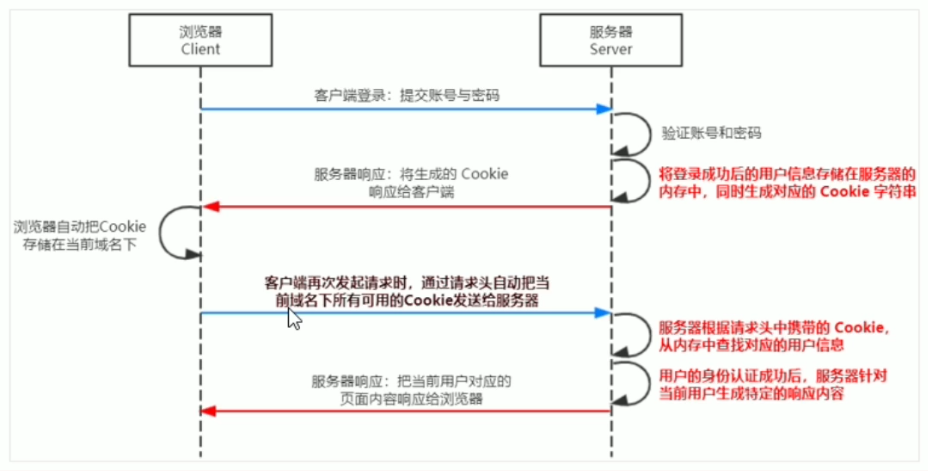

# Basic concept of database
## What is database?
  Database is repository used to **organize**,**storage** and **manage** data. 
  
  Now this world is internet world full of data, and full of quantity data. 
There are resource of data, for example, travel records,expense records,websites visited and send message.

For convenient managing data in the internet world, there is the concept
of database management system (called for short: database). User
can operate data,for example, they can create, query, update and delete data.

# web develop mode
## Web develop mode for server rendering
**The concept of the server rendering:** HTMl page from the 
server to client is linked by string at server and dynamically generated.
therefore, the client doesn't need use extra technical such as
ajax to request page data. An example of this code is as follows.
```js
app.get('/index.html',(req,res)=>{
    // 1. needing render data
    const user = { name:'卓越',age:22};
    // 2. the server dynamically generate html content by concat string.
    const html = `<h1>name:${user.name}, age:${user.age}`;
    // 3. the server response generated thml content to the client. therefore, the client receives html page with really data.
    res.send(html);
})
```
## Authentication
### what is authentication?
  Authentication refers to confirm to user identity through certain means.
 - the authentication can be seen everywhere in daily life,such as
 checked ticket, phone password, pay password of the alipay and WeChat.
 - In web development, the authentication of user identity is involved, 
such as phone dynamically code login, email password login and QR code
login and so on.
### the authentication of different development mode.
 there are different authentication schemes for server rendering and front and back end separation.
  1. `Session authentication` is recommended for server rendering.
  2. `jwt authentication` is recommended for front and back end separation.
### what is cookie?
  Cookie is a string of not more 4KB stored in the user's browser. it consists
  of a name, a value and selected attribution of controlling cookie period of 
  validity, security and use range of application.
  #### There are several features of cookie.
1. auto send.
2. domain independent.
3. period of validity.
4. 4KB limit.
#### session work theory
